# TIC-TAC-TO-INFINITY

A terminal Application of the classic Tic-Tac-Toe game with a great twist.

Created by Areli Mendoza Perez for a Project with Coder Academy.

## Link to Source Control Repository (R4)

[Tic-tac-to-Infinity GitHub Repository](https://github.com/arelimdz/tictactoe-cli)

## Code Style Guide used (R5)

This code is formatter by Black and the resulting code style is compliant with PEP 8.

## Instruction and Help

### System Requirements

To run this application the user needs to have Python 3 installed on their computer.

To check if python 3 is installed, use the following command:

```sh
python3 --version
```

or

```sh
python --version
```

To install the latest version of Python 3 visit the following page:

[Download Python](https://www.python.org/downloads/)

### Dependencies

1. Python 3 (Python versions 3.11 and above are officially supported)
2. pytest (for testing)
3. pytest-cov (for reporting code coverage)

### How to install application (R8)

To run the application on the user's computer follow the next steps:

1. Open the terminal or Git Bash.

1. Navigate to the directory where you want to store the application.

1. In the terminal, run the following commands:

```sh
$ git clone git@github.com:arelimdz/tictactoe-cli.git
```

1. cd into the newly cloned directory

```sh
$ cd ./tictactoe-cli
```

1. Ensure the game is executable

```sh
$ chmod +x ./run_game.sh
```

1. Run the game:

```sh
$ ./run_game.sh
```

## Description of application

Tic-Tac-Infinity is the classic Tic-Tac-Toe game with two unique additions:

1. Extensible: Users can resize the game board to their desired size, set their own winning line length size
2. Personalisable: Users can set player names.

It continues to maintain the essence of the classic game that we all know. It requires two people to be played. It consists of alternately each one of the players makes a move in one of the available grids, trying to be the first to mark three consecutive grids with their mark.

## Application Features (R6)

### - Player vs Player Tic Tac Toe gameplay

To make tic-tac-to-infinity a more enjoyable game, I designed it as a multiplayer (2 players) game.

For this I used a function `main_game_loop()` with a while loop that continuously iterates until either a winner is identified or the board out of empty spaces.

To keep my code DRY I have embedded in this main loop functions so that the application addresses one player each cycle.

The game will always start with the player 1 marked "X", and then player 2 marked "O". The game will move to the next cycle only once the player in turn enters a valid position.

When the game ends, the application prompts the user for interaction and asks if they would like to play again.

### - Scalable Tic Tac Toe board size and winning line length size

This application is designed to be scalable. This means that users can create very large boards with this application (I manually test a board with a 1000x1000 grid). Such a big board requires a gigantic screen to be displayed correctly. Thinking about the users and what would be best to improve their experience with the game, I decided to limit this scalability to a range of 2 to 20 and create a board with a maximum of 400 positions.

### - Personalised gameplay experience with configured player names

The application allows players to personalise the game with their names. This configuration only needs to be completed once and is recorded on the hard disk of the computer. Every time the player runs a new session of the application, the application will refer to the players by their configured names.

However, if the player decides not to make any changes, the game will still be able to differentiate the users, using the default values: "Rick" for player 1 and "Morty" for player 2.

### - Checking for winner

This feature allows the program to evaluate if there is a winner, thanks to the automated function that evaluates the board in each move and responds quickly either to congratulate the winner or to continue with the game.
This speed is thanks to the approach of only examining the surroundings in the range of the length of the winning line, and not the entire board.

To do this, the application uses 4 main functions that are linked together to perform the following evaluations:

1. Check if the move is a winning move (is_winning_move) :
   To do this, the function examines the positions around the position marked by the player, through two pointers that move forwards and one backwards, taking as reference the position marked by the player.

2. Check that the pointers are within the limits of the board (is_valid_pointer) :
   Because the pointers move it is necessary to check that once they reach the edges of the board they stop.
   This is possible thanks to the implementation of a function that returns False once the pointer reaches the start or end position of the row and column.

3. Check if the board is marked with the player's mark (is_mark) :
   Another important criteria for stopping pointers is to identify a position that is marked by the opposing player. Well, it would not make sense to continue moving and keep looking when the criteria to win is not met.

4. Check if the player won (has_player_won):
   It is at this point where the coordinates are pass to the is_winning_move function so that the pointers move towards the indicated directions: horizontally (left and right), vertical (up and down) and forward diagonal "/" (left-down and right-up) diagonal backwards "\"(left-up and right-down)
   To return True or False and find out if there is a winner

### - Simple to use menu system

A menu system has been integrated into this application to facilitate its use.

It is user friendly and prints an options menu each time the user moves to different parts of the application.
As shown in the following graph:

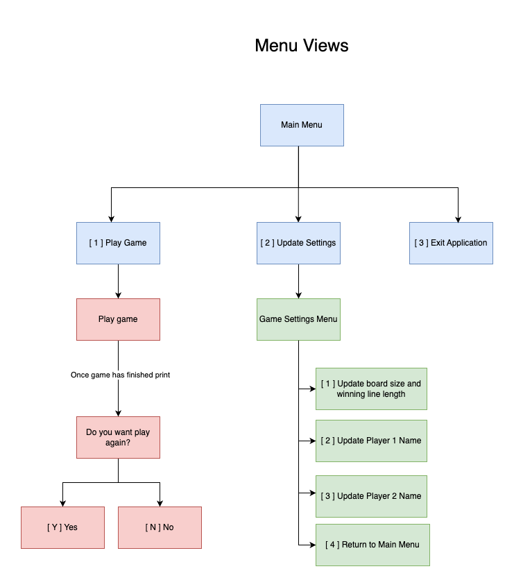

### - Load and save game settings to file between application sessions

This functionality of the application allows to save the changes made by the user in the hard disk of the machine where the application is located.

The first time the user enters the game, it will use the game's default values that are saved in a json file.

This json file is updated every time the user changes the values of the board, the length of the goal to win, and/or the names of the players from the Game Settings section.

If for some reason this file is deleted the application will create a new file with the default values.

If for any reason the user tries to change the values of the application from the json file, and these are outside the established limits (a board with a maximum size of 20x20 grids, or a goal length to win larger than the size rows or columns) the application will ignore the values in the file and use the default values.

The default values are the following:

```json
{
  "num_rows": 4,
  "num_columns": 4,
  "win_target": 4,
  "player_name_1": "Rick",
  "player_name_2": "Morty"
}
```

### - Table flipping

Virtual games shouldn't be that different from physical board games, which is why I've included this feature so that players can act antisocial or express their frustration just by flipping the game table during their turn.

(╯°□°)╯︵ ┻━┻

This in turn is a fun way to stop the app in the middle of the game if any of the users want it to for some other reason.

## User Interaction and Experience

This is an example of how the user can interact with the application from the terminal.

My terminal game has been designed to be user friendly, on each screen it gives easy instructions to the user to navigate the application.
The first screen that receives the user is the game cover as shown below:

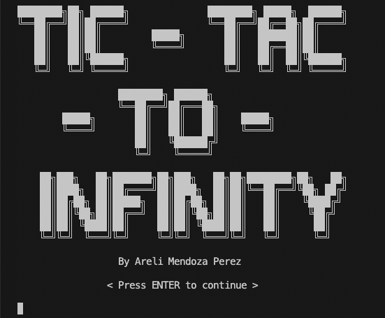

- Application Main Menu

The second screen that the user will see is the main menu of the game. From this menu the user can go directly to play the game or visit the settings menu and customize the game.
For this example, we will visit the settings menu to make some changes, we enter option 2 and hit enter.

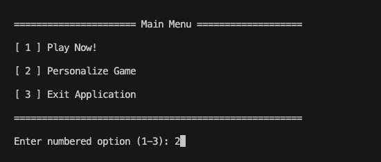

- Game Settings Menu

This screen gives the user a menu of options depending on what they want to change.
The menu shows the current values of each section that can be customized.

For this example, let's extend our board. We introduce option 1 and hit enter.


- Applying changes

The app will give you step by step instructions to modify the size of the board and set the size of the target win line, as shown in the following image.

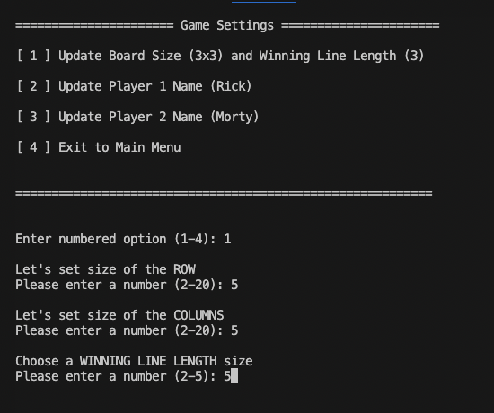

- Updating game settings values and return main menu

Once we give the last value and hit enter, the screen in the terminal will be cleared and the settings menu will be updated with the values provided, as shown in the following image.

Now we are ready to play! To return to the main menu, we exit the configuration menu by simply entering option 4 and pressing enter

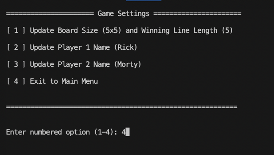

- Play Game

To start the game the user has to go to the main menu and from there enter option 1 and hit enter.

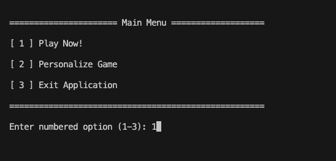

- Game Display

Once the user has started the game, an empty 5x5 grid board with 25 available positions will be displayed.

The program will give specific instructions to the user to enter the position to be marked, once the player enters the desired position and presses enter the game will mark the position for the user.

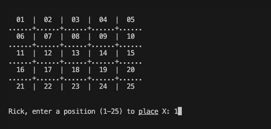

- Invalid input handling

The application is capable of handling invalid inputs by the player and prints different messages depending on each situation.

An entry may be invalid for the following reasons:

- Input is a non-numeric character
- Input is a number outside of the range of board positions
- Blank or no input
- Inputted position is already occupied on the board

The application will not continue the game until the player in turn enters a valid position, as shown in the following image.

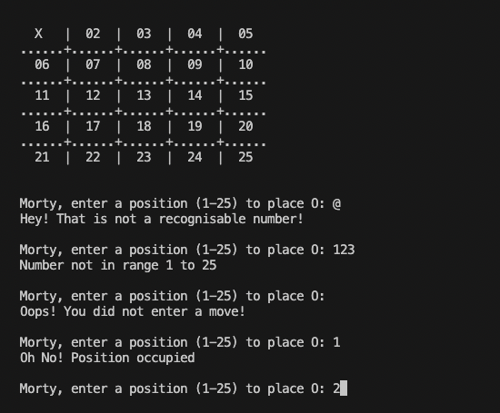

- Check if there is a winner

Like the classic tic-tac-toe game, the player who first makes a continuous line with his mark ("X"/ "O") on the board wins. This continuous line can be vertical, horizontal, forward diagonal or backward diagonal.

As shown in the following images:

- Rick wins vertically

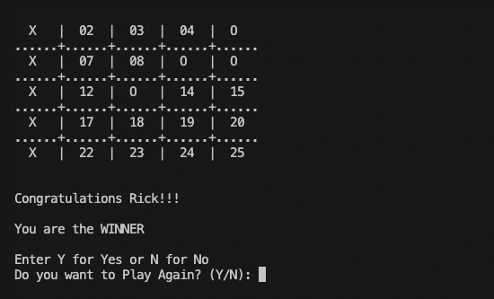

- Rick wins horizontally

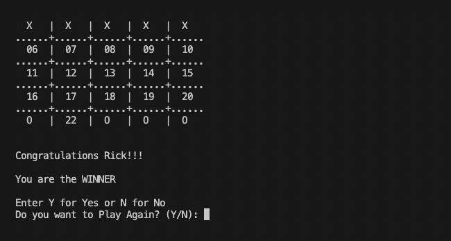

- Rick wins with a forward diagonal line

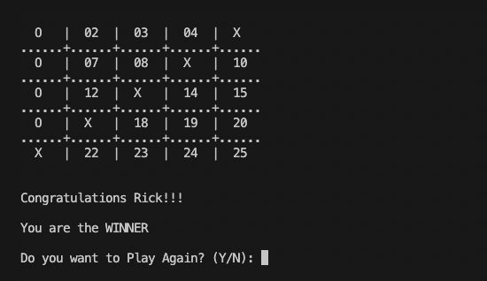

- Rick wins with a backward diagonal line

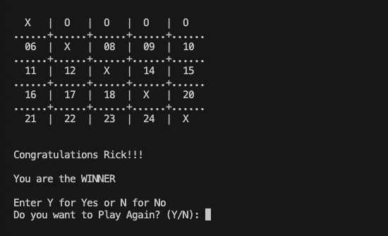

- No winners / draw / stalemate

If no further valid moves can be made by either player, the application ends the game, as shown below

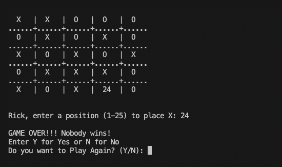

## Software Development Plan

### Control Flow Diagram

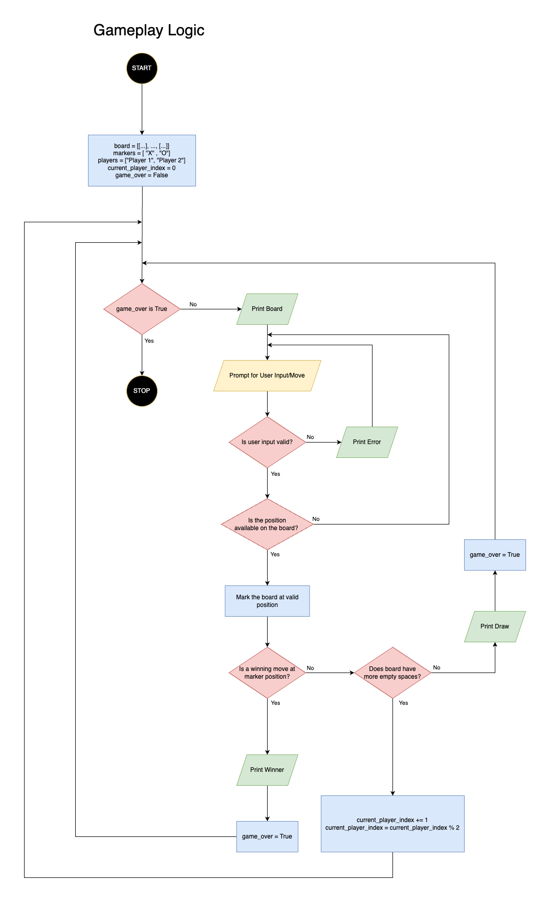

### Implementation Plan (R7)

In order to execute this project in 2 weeks, I need to design a plan for the development and implementation of my Tic-Tac-To-Infinity application.
I use the project management software Trello to track and record the activities carried out during the development and implementation of the application:
The Original Plan was to develop and implement the following features in the following chronological order:

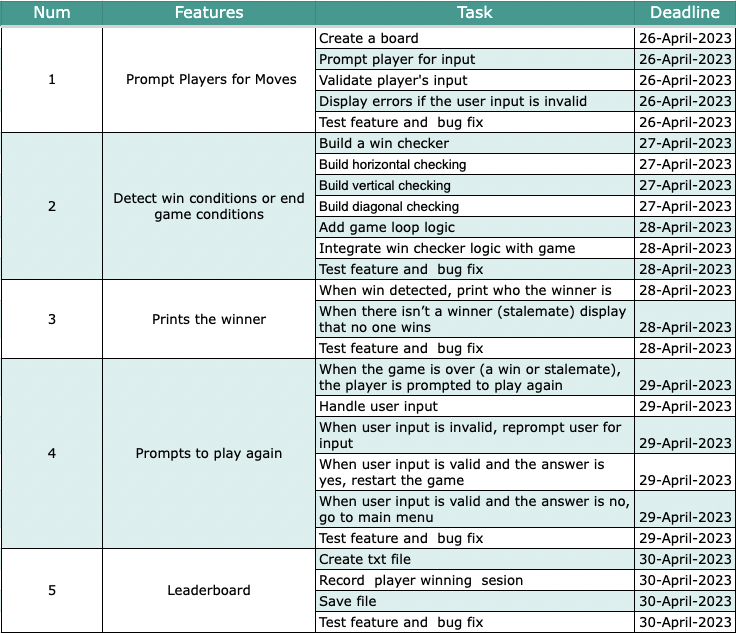

However, during the implementation of the game I realized that it was not possible to follow this plan and because of how intertwined the design of the application was.
My main goal was to create an application that is scalable and easy to maintain. To achieve this goal I used the Agile methodology, which allowed me to iterate each of my functions and improve them at each planning stage (when a new feature was added).

I removed features that didn't add value to my app, and added new features to the game to make it scalable, interactive, and easy to use.

Below are the screenshots of the Trello Application the tasks developed on different dates.

- April 26, 2023


- April 27, 2023


- April 28, 2023


- April 29, 2023


- April 30, 2023


- May 01, 2023
  

- May 02, 2023


- May 03, 2023


- May 04, 2023


- May 05- 06, 2023
  

## Testing (R15)

### How to run automated tests

Run the following in bash:

```sh
python -m venv ./.venv && \
    source ./.venv/bin/activate && \
    pip install -e . && \
    python -m pytest
```

### How to obtain a reporting of code coverage

Run the following in bash:

```sh
python -m venv ./.venv && \
    source ./.venv/bin/activate && \
    pip install -e . && \
    python -m pytest --cov=src tests/
```
